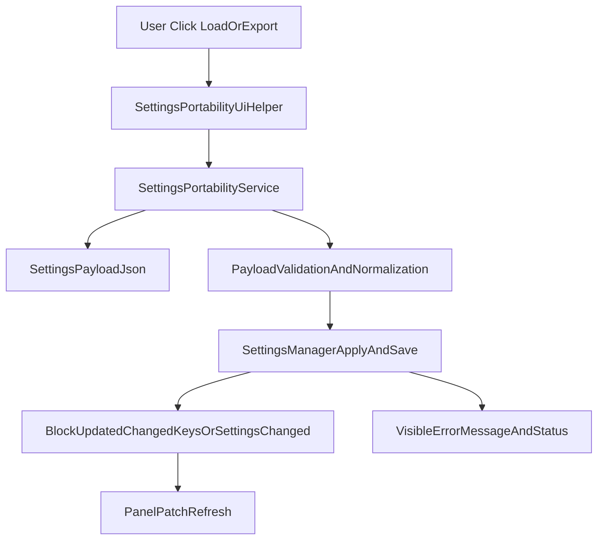

# Centralized Settings Load/Export Plan

## Objective

Create one reusable import/export flow for settings so every settings-capable UI can:

- export current settings to a file,
- load settings from a file,
- validate and apply via existing settings managers,
- fail loudly with clear user feedback.

## Default Decisions Used

- Scope: block panels + global settings dialog + timeline settings panel.
- Security: sensitive keys excluded from export by default (`token`, `secret`, `password`, `api_key`, `access_key` patterns), with optional explicit include flag in payload.

## Implementation Architecture

1. Add a single settings portability module for serialization/deserialization, filtering, and schema metadata.
2. Add a shared UI helper for file dialogs + user confirmations + error display.
3. Integrate into `BlockPanelBase` once so all block panels inherit load/export buttons automatically.
4. Integrate into global settings dialog and timeline settings panel with the same helper.
5. Add tests to enforce format compatibility, sensitive-key handling, and apply semantics.

## Files to Add

- `[/Users/gdennen/Projects/EchoZero/src/application/settings/settings_portability.py](/Users/gdennen/Projects/EchoZero/src/application/settings/settings_portability.py)`
  - `SettingsPortabilityService`
  - payload schema versioning
  - key filtering (sensitive + allowlist/denylist)
  - `export_payload(...)`, `import_payload(...)`, `validate_payload(...)`
- `[/Users/gdennen/Projects/EchoZero/ui/qt_gui/widgets/settings_portability_ui.py](/Users/gdennen/Projects/EchoZero/ui/qt_gui/widgets/settings_portability_ui.py)`
  - common QFileDialog wiring
  - success/error confirmation UX
  - import preview + overwrite confirmation text

## Files to Update

- `[/Users/gdennen/Projects/EchoZero/ui/qt_gui/block_panels/block_panel_base.py](/Users/gdennen/Projects/EchoZero/ui/qt_gui/block_panels/block_panel_base.py)`
  - add footer actions: `Export Settings`, `Load Settings`
  - base handlers that use `_settings_manager` when present
  - default hooks for panel-specific import post-processing (`on_settings_imported(...)`)
- `[/Users/gdennen/Projects/EchoZero/src/application/settings/block_settings.py](/Users/gdennen/Projects/EchoZero/src/application/settings/block_settings.py)`
  - add safe bulk-apply helper (`apply_settings_dict(...)`) with per-field validation + changed key reporting
- `[/Users/gdennen/Projects/EchoZero/src/application/settings/base_settings.py](/Users/gdennen/Projects/EchoZero/src/application/settings/base_settings.py)`
  - add equivalent bulk-apply helper for app/timeline managers
- `[/Users/gdennen/Projects/EchoZero/ui/qt_gui/widgets/settings_dialog.py](/Users/gdennen/Projects/EchoZero/ui/qt_gui/widgets/settings_dialog.py)`
  - add `Export Settings` / `Load Settings` using shared UI helper
- `[/Users/gdennen/Projects/EchoZero/ui/qt_gui/widgets/timeline/settings/panel.py](/Users/gdennen/Projects/EchoZero/ui/qt_gui/widgets/timeline/settings/panel.py)`
  - add same controls + manager apply + refresh emit
- `[/Users/gdennen/Projects/EchoZero/src/application/settings/__init__.py](/Users/gdennen/Projects/EchoZero/src/application/settings/__init__.py)`
  - export portability service symbols if needed

## Payload Contract (Versioned)

- Top-level:
  - `schema_version`
  - `settings_scope` (`block`, `app`, `timeline`)
  - `settings_type` (manager/schema id)
  - `created_at`
  - `include_sensitive` (bool)
  - `settings` (key/value dict)
- Import behavior:
  - reject incompatible `settings_scope`/`settings_type`
  - ignore unknown keys with warning
  - validate known keys; apply only valid keys
  - show summary: applied, skipped, failed

## Fail-Loud Behavior

- Validation failures: modal warning + footer/status summary listing invalid keys.
- Payload mismatch (wrong panel/type): blocking error with explicit expected vs actual.
- Save failure: reuse existing settings failure channel + immediate `QMessageBox`.

## Backwards Compatibility and Cleanliness

- No changes to existing panel-specific settings logic required for initial rollout; base class adds capability where `_settings_manager` exists.
- For panels without `_settings_manager`, hide/disable load/export actions with clear tooltip.
- Keep format versioned to allow future migration without breakage.

## Rollout Steps

1. Build portability service + UI helper.
2. Integrate block panels via `BlockPanelBase`.
3. Integrate global settings dialog.
4. Integrate timeline settings panel.
5. Add tests + update docs.

## Tests

- Add unit tests:
  - `[/Users/gdennen/Projects/EchoZero/tests/unit/test_settings_portability.py](/Users/gdennen/Projects/EchoZero/tests/unit/test_settings_portability.py)`
  - payload version validation, sensitive filtering, unknown key handling.
- Add integration/UI-behavior tests:
  - `[/Users/gdennen/Projects/EchoZero/tests/unit/test_settings_write_path_guardrails.py](/Users/gdennen/Projects/EchoZero/tests/unit/test_settings_write_path_guardrails.py)` updates for portability hooks.
  - new test for block panel import/export actions and manager apply.

## Council Recommendation

- Architect: approve (single central service avoids duplicated per-panel logic).
- Systems: approve (versioned schema + validation makes failures deterministic).
- UX: approve (consistent buttons and messages across all settings UIs).
- Pragmatic Engineer: approve (base-class rollout gives immediate wide coverage).

Proceed with centralized service + base integration first, then global/timeline surfaces, then tests.