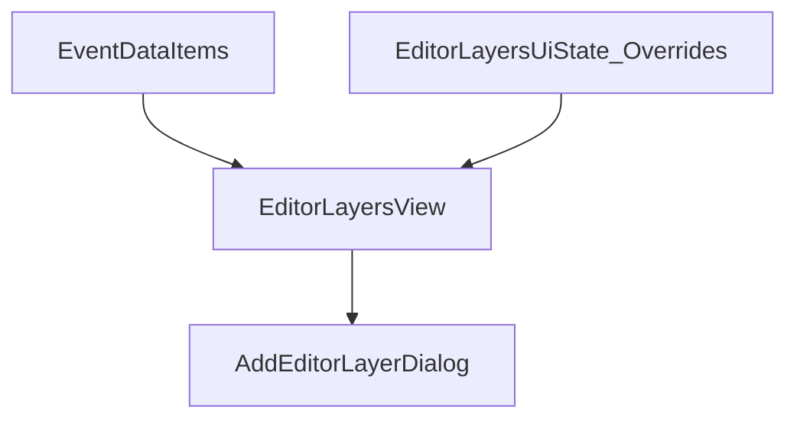

# Duplicate Editor Layer Groups

## Problem Summary
The "Add Editor Layer" dialog shows duplicate groups/layers. The duplicates present as a second copy of the same group with identical layer names (for example, `kick`, `clap`, `snare`, `hihat`, `onset`) under a different group identifier.

## Runtime Evidence
- `EditorGetLayersCommand.redo` shows `count: 15`, `unique_names: 6`, `unique_pairs: 15`, confirming duplicate layer names across distinct group IDs.
- `run23` shows stale group IDs in UI state:
  - `event_item_count: 5`
  - `layer_group_count: 5`
  - `stale_group_count: 4`
  - `stale_group_sample`: group IDs that no longer exist as EventDataItem IDs.

These findings indicate that `editor_layers` UI state contains groups that no longer map to current `EventDataItem.id` values.

## Root Cause
`editor_layers` is treated as a source of truth for dialog listing and is persisted across runs. When `EventDataItem` sets change (for example after execution or data refresh), old `group_id` entries remain in `editor_layers`. This causes stale group IDs to be surfaced as additional groups, even though the underlying data items no longer exist.

The architecture currently duplicates state:
- **Data source**: `EventDataItem` (current truth for layers)
- **UI state**: `editor_layers` (should only store presentation overrides)

The duplicate groups are a symptom of this dual state diverging.

## Best Part Is No Part Resolution
Remove `editor_layers` as a source of truth for the dialog list. Only derive layers/groups from current `EventDataItem` data, and use `editor_layers` purely for presentation overrides keyed by `(EventDataItem.id, layer_name)`.

This eliminates the extra state that can drift and removes the need to reconcile stale `group_id` entries.

## Restoration Plan
1. **Rebuild list from data items**: Use `EventDataItem.id` as `group_id` and `EventLayer.name` as the layer name for the dialog.
2. **Use UI state only for overrides**: Apply height/color/visibility overrides from `editor_layers` if a matching `(group_id, layer_name)` exists.
3. **Drop stale UI state**: When a `group_id` is not in current `EventDataItem` IDs, discard it during load. Do not re-save it.
4. **Preserve sync groups**: Keep `tc_` timecode groups and MA3 sync layers intact.
5. **Verify**: Dialog group count should match current EventDataItems; no duplicate group sets.

## Short-Term Mitigations In Place
- Dialog grouping now keys by `group_id` and adds a suffix to differentiate same `group_name`.
- `EditorGetLayersCommand` filters layers whose `group_id` does not map to current `EventDataItem` IDs, preventing stale groups from appearing.
- `_save_layer_state` skips saving when no EventDataItems are loaded to avoid persisting stale state.

## Validation
- Dialog shows only groups for current `EventDataItem` IDs.
- Layer list order and group order match the current editor timeline.
- No duplicate groups/layers appear after reopen.

## Data Flow (Target Architecture)

## Relevant Code
- `/Users/gdennen/Projects/EchoZero/src/application/commands/editor_commands.py`
- `/Users/gdennen/Projects/EchoZero/ui/qt_gui/block_panels/editor_panel.py`
- `/Users/gdennen/Projects/EchoZero/ui/qt_gui/dialogs/add_editor_layer_dialog.py`
